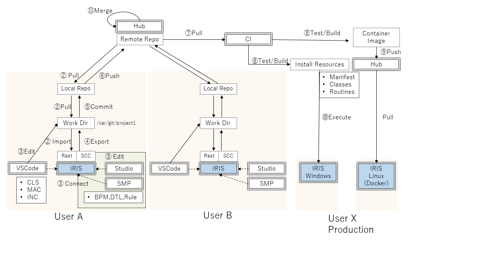
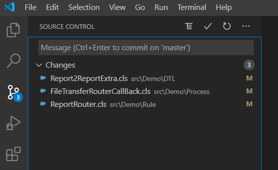
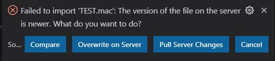

WIP  
リモートや在宅での勤務が一般化しつつあります。  
そのため、今までの集中型、オンサイトの開発体制を見直し、分散型の開発体制への移行を迫られているユーザさんも多いのではないかと思います。
VSCodeを使用したIRISアプリケーションの開発が、コミュニティーを中心に広まり始めて久しいですが、Gitとの相性が良いこの開発ツールが今後さらに浸透していくことは間違いありません。あちらこちらで、その使いまわし方が語られていますが、日本語でのご紹介が少なかったように思いますので、ここでは、ソースコントロールとの関連を中心にご紹介したいと思います。

> 間の良いことに、VSCode InterSystems ObjectScript Extensionのプロダクションリリース(V1.0.x)の配布が始まりました。  
> https://community.intersystems.com/post/objectscript-extension-vs-code-reaches-10  
> これに合わせて、今までのコミュニティーサポートに加え、InterSystemsによる公式サポートもアナウンスされています。

## 目的
メインの開発ツールとしてVSCode+ObjectScript Extensionを使用している環境でのソースコード管理について、その流れを解説します。
また、スタジオや管理ポータルを使用したInteroperability機能のBPL,DTL,Ruleの編集内容をソースコード管理に加える方法を例示します。  

## 前提
* 各利用者が専用のワークディレクトリ、ローカルレポジトリを持つ  
これを共有してしまうと、コミット内容にあわせて編集対象をステージングするというGitの基本的な操作が出来なくなります。
>一時的にデバッグ用途で作成したルーチン(test1, deb2)などを誤ってソースコード管理に追加するのは避けたいものです。

* VSCodeとスタジオで同一のワークディレクトリ、ローカルレポジトリを使用する  
これを別にしてしまうと、同じファイルを別のローカルレポジトリにコミットするという危険を排除出来なくなります。
また、VSCode,スタジオ双方を使用した一連の修正をコミットするという操作が出来なくなります。

* 各利用者が編集時の接続先となる専用のIRIS環境を持つ  
これを共有してしまうと、利用者どうしの修正が逐次干渉しあい、またコミット前の修正を"ダーティリード"することになるため、分散開発のメリットが損なわれます。

これら前提を満たす、2種類の環境を例示します。  
1. 全てローカル  
各利用者がIRISインスタンス自体をローカルPC上にインストールして個人環境として使用しながら開発を進めます。
Gitのような分散型のソースコード管理と相性が良く、スタジオのソースコントロールとの共存も容易なため、お勧めです。

2. IRIS環境を共有  
全利用者が共有のIRIS環境を使用します。前提を満たすためにネームスペースとそこに紐づけるデータベース、ワークディレクトリを、各利用者ごとに用意します。後述の手間がかかるため、あまりお勧めはしません。  

|利用者|ネームスペース|データベース|用途|
|:--|:--|:--|:--|
|UserA|MYAPP_USERA|myapp_usera/IRIS.DAT|ソースコード|
|||common/IRIS.DAT|共通ソースコード|
|||data_usera/IRIS.DAT|データ|
|UserB|MYAPP_USERB|myapp_userb/IRIS.DAT|ソースコード|
|||common/IRIS.DAT|共通ソースコード|
|||data_userb/IRIS.DAT|データ|

通常、VSCodeのワークディレクトリはローカルPC上ですが、スタジオや管理ポータルを併用する場合(ソースコントロールフックを使用する場合)、VSCodeのワークディレクトリもリモート上に用意し、Remote Development extensionでSSH接続します。  
これはLinux向けの機能ですが、SSHとWSLを導入すれば、WindowsであってもVSCodeのリモート接続対象になれます。

1,2共にIRISをDockerで稼働させることで、後述するブランチの切り替え時操作も非常に楽になります。
> 魅力的な選択子ですが実行環境がLinuxに限定されます。

## 使用するソースコード管理機能
VSCodeでは標準のソースコントロール機能(Git)を使用します。
スタジオ/管理ポータルでは、編集内容を保存時にワークディレクトリに出力するソースコード管理フックを使用します。

## 実行例
上述の「全てローカル」の場合を例にとり使用方法の流れを俯瞰します。  
全体の流れは、Gitを使用した共有リポジトリパターンの典型的な開発フローと何ら変わりありませんので、利用環境に合わせて適用いただくための参考としてご覧ください。

1. リモートリポジトリを作成  
開発プロジェクトProject1用に、管理者がレポジトリ名:Project1, ブランチb1を作成。
```bash
cd \var\git
git clone https://github.com/IRISMeister/Project1.git
cd Project1
git checkout -b b1
git push --set-upstream origin b1
```

2. フォルダ構成の決定  
決まりはありません。ここでは、下記のようなフォルダ構成とします。  
```
フォルダ名: Project1    通常レポジトリ名と一致する。
C:\var\git\Project1     ここにローカルレポジトリ(.gitフォルダ)が存在
C:\var\git\Project1\... ここにIRISと直接関係のないファイル(他プログラミング言語要素、リソース、docker関連のファイルなど)を配置
C:\var\git\Project1\src ここにIRIS関連ファイル(cls, mac, incなど)を配置
```
3. 参加各位のローカルフォルダにgit clone  
ブランチをb1に切り替えて作業開始
```bash
cd \var\git
git clone https://github.com/IRISMeister/Project1.git
cd Project1
git checkout b1
```
4. ツールの初期設定  
VSCodeでの設定
単にそのワークディレクトリを開くだけです。
```
cd \var\git\Project1
code .
```
ローカルIRISのMYAPPネームスペース(後述)を接続先に指定します。
VSCodeでは、.VSCode/settings.jsonに下記のような接続情報を設定します。
```
    "objectscript.conn": {
        "active": true,
        "host": "localhost",
        "port": 52773,
        "ns": "MYAPP",
        "username": "SuperUser",
        "password": "SYS"
    }
```
> よりセキュアなInterSystems Server Managerを使用いただきたいところですが本題から逸れてしまうので割愛いたします

スタジオでの設定  
BPM,DTL,Ruleの編集内容をソースコントロールに含める必要がある場合、スタジオになんらかのソースコントロールフックの導入が必要です。  
ソースコントロールフック(%ZScc.Basic)を導入・有効化し、ファイル出力先として、ワークディレクトリを指定します。
```
Set $NAMESPACE="MYAPP"
^ZScc("Basic","LocalWorkspaceRoot")="c:\var\git\Project1\"
^ZScc("Basic","Src")="src"
```
その後、通常の接続操作でMYAPPネームスペースに接続します。これで当該ネームスペース上にてソースコントロールが有効化します。
また、この設定は、管理ポータルでのBPM,DTL,Rule編集画面でも有効になります。

5. 開発作業  

git pull - コンフリクト解消 - ローカルIRISへのImport - 開発作業 - git add/commit - git push  
この繰り返しになります。  
主な編集作業はVSCodeで行います。InteroperabilityのBPL,DTL,Ruleだけは、スタジオもしくは管理ポータルで編集作業を行います。  
>BPL,DTL,Ruleもビジュアルな編集ではなく、ソースコードとして編集を行うのであればVSCodeで可能です

スタジオでのソースコード管理コマンドの実行方法はメニュー操作になります。  
また、ソースコントロールフックの有効化を行うと、管理ポータルのBPL,DTL,Rule編集画面などにソースコード管理ボタンが提供されます。  
  
左のアイコンでメニュー操作、右のアイコンで出力の確認を行います。  
ただし、本例で使用する%ZScc.Basicのフックは、ソースコード保存時に、自動的にワークディレクトリに対象をエクスポートするだけですのでメニュー操作はほぼ不要です。  
>Git用のソースコントロールフック(%ZScc.Git)を選んだ場合、各Gitコマンドの発行が可能になりますが、本稿の対象外です。スタジオ単体利用に、よりフォーカスした[ソースコントロールフック](https://openexchange.intersystems.com/package/Cach%C3%A9-Tortoize-Git)もあります。

開発作業のイメージ


- 他の利用者による修正を反映、コンフリクトがあれば解消します。修正内容をローカルIRISに反映します。画像(2)  
- ローカルIRISを使用しながら開発・単体テストを実行します。画像(3)    
- (必要に応じて)スタジオや管理ポータルでBMP,DTL,Ruleを新規作成・編集します。画像(3,4)   
これらの変更はVSCode上で、未ステージング状態の変更要素として認識されます。  


- 適宜ローカルのレポジトリにコミットします。  
VSCode(お勧め)、コマンドラインで実行します。画像(5)  
- 適宜リモートレポジトリにプッシュします。  
VSCode(お勧め)、コマンドラインで実行します。画像(6)  

6. 自動化テスト
継続的にテスト実施するような環境を使用して、リモートリポジトリのb1ブランチのソースコードをテストします。 画像(7)  
Dockerを使える(プロダクション環境がLinux環境)と楽です。画像(8,9)  
[こちらに](https://github.com/IRISMeister/simple/blob/master/.github/workflows/dockerpush.yml)GitHub Actionを使用して、IRISベースのDockerイメージを作成する例があります。  

プロダクション環境がWindowsの場合はチャレンジングな項目になります。可能性としては、WindowsでDOSやPowerShellを起動可能なCI/CDツールとIRISの無人インストール機能を組み合わせるなどして実現していく事になると思います。画像(10)

7. リリース作業
管理者がb1ブランチをmasterブランチにマージします。画像(11) 

8. 新規リリースに向け、b2ブランチを作成。以降、繰り返し。

## ブランチとネームスペースについて
>シンプルな構造(ビルドに必要な全てのユーザ作成のソースコードが単一のデータベース上に存在、ブランチはmasterのみ)の採用が可能な小規模での開発が可能な場合は、これらを気にする必要はありません。  

ネームスペースが指し示すソースコード保存用のデータベース(ルーチンのデフォルトデータベース)に関して配慮が必要です。
ネームスペースとソースコードの保存場所は、1対1とは限りません。パッケージマッピングなどにより複数のデータベースに跨っている可能性があります(共通関数などを別個のデータベースに配置している場合など)。これら共通関数は、使用するプロジェクトとは切り離してソースコード管理される可能性もあります。  
そのことを考慮すると、ブランチ切り替えの際に、単純にネームスペースで認識できる既存のソースコードを「全部削除」して、切り替わったソースコードと置き換える、というオペレーションでは、どうしても、削除もれや削除し過ぎ、といったミスや無駄な再コンパイル発生を排除できません。
少々手間ではありますが、各ブランチに対応するソースコード保存専用のデータベースを個別に用意しておいて、ブランチを切り替える際には、ネームスペースのメインのソースコードの保存場所も切り替えるのが最も安全だと思います。  
IRIS環境を共有する場合は、さらにこれらが各利用者ごとに分かれますので、ブランチ数×利用者数の数だけデータベースを作成することになり、かなりの手間となります。


|ブランチ|ネームスペース|データベース|用途|
|:--|:--|:--|:--|
|master|MYAPP|myapp/master/IRIS.DAT|ソースコード|
|||CommonPackage/IRIS.DAT|共通ソースコード|
|||DATA/IRIS.DAT|データ|
|b1|MYAPP|myapp/b1/IRIS.DAT|ソースコード|
|||同上|共通ソースコード|
|||同上|データ|
|b2|MYAPP|myapp/b2/IRIS.DAT|ソースコード|
|||同上|共通ソースコード|
|||同上|データ|


一方、開発時のIRISの稼働環境として、リモートレポジトリを使用して焼いたDockerイメージを使用すれば、切り替え操作は個別の利用者から隠ぺいされ、手間(なによりもオペミス)が大幅に削減できます。
> IRIS DockerイメージはLinux(Ubuntu)ベースですので、プロダクション環境もLinuxである必要があります

|ブランチ|イメージ名|ネームスペース|データベース|用途|データベース保存場所
|:--|:--|:--|:--|:--|:--|
|master|MYIRIS:master|MYAPP|myapp/IRIS.DAT|ソースコード|イメージ内
||||CommonPackage/IRIS.DAT|共通ソースコード|イメージ内
||||DATA/IRIS.DAT|データ|外部データベース
|b1|MYIRIS:b1|MYAPP|同上|ソースコード|イメージ内
||||同上|共通ソースコード|イメージ内
||||同上|データ|外部データベース
|b2|MYIRIS:b2|MYAPP|同上|ソースコード|イメージ内
||||同上|共通ソースコード|イメージ内
||||同上|データ|外部データベース

## IRIS環境を共有する際の注意点
同一のネームスペースを複数の利用者が共有した場合、誰かの修正を他の人がVSCode経由で上書きしようとすると、ObjectScript Extensionから警告を受け、そのコンフリクト解消のための選択を促されます。
  
小規模開発であれば、これを使用して開発を進めることも可能です。
> これは分散開発ではありませんが

VSCodeには、スタジオの操作環境に近い、サーバサイドを直接編集するモードもありますので、その利用を検討されるのも良いかもしれません。
> このモードではワークディレクトリもローカルレポジトリも使用されないためVSCodeのGitも使用できません
